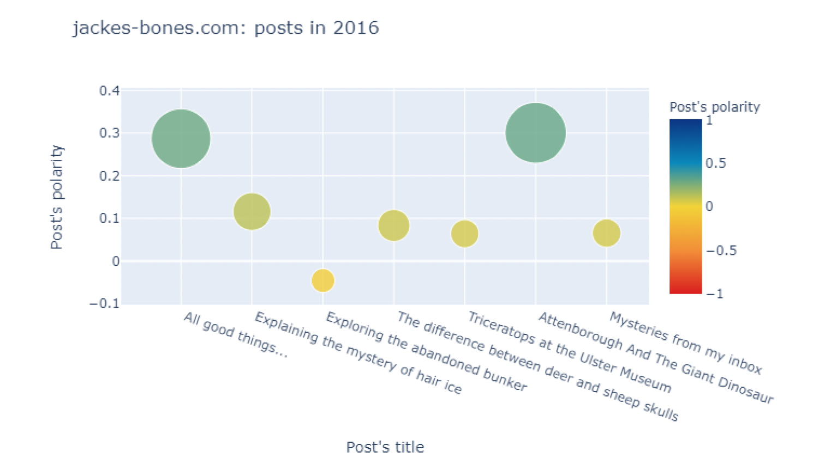

# thematic-analysis-helper
> An auxiliary tool for thematic analysis in qualitative research using data visualisation in Dash, NLP model and topic modeling.
> 
> Developed as a final project for the [University course](https://lnu.se/en/course/programming-for-digital-humanities/vaxjo-distance-exchange-part-time-autumn/) (Programming for Digital Humanities, scope: 15 ECTS, 2019-2020)

## Table of contents
* [General info](#general-info)
* [Technologies](#technologies)
* [Setup](#setup)
* [Illustrations](#illustrations)
* [Contact](#contact)
* [References](#references)

## General info

Thematic Analysis is a method of identifying and analyzing patterns of meanings in a dataset. As one of the most common methods within the field of qualitative analysis, it’s widely used on variety of data, such as field research, interviews, observation, solicited diaries and story completion [1]. The method consists of few phases, one of which is coding (tagging items of interest in data with a label: a few words or a short phrase). Such content analysis helps to primarily identify themes in next phase.

### An auxillary tool for thematic analysis

The preliminary purpose of the tool would be to serve child psychologists and counselors in initial assessment of child welfare. Behavior Diaries (solicited diaries) and story completion are among main qualitative research methods and are commonly used in developmental psychology [2-3]. Children are often asked to journal about their everyday life or given topic. The tool could be deployed as next step in analysis of such text.

With the help of this algorithm, users can facilitate following processes in their thematic analysis research: accessing online data of big volume, extracting the essence (information of interest), analyzing the content, plotting the most interesting data pieces in multiple way, training NLP machine learning model on data they choose, performing topic modeling on chosen data (or extraction of data).

### Case study

Three children’s blogs (due to similarity of blogs to journals and diaries) of high originality and distinct leading topics were taken up to test the tool on: [jakes-bones](http://www.jakes-bones.com), [lidbemchild](http://libdemchild.blogspot.com), [neversconds](http://neverseconds.blogspot.com). The goal was to present the diversity in children’s writing and provide an insight into tendencies, attitudes and dominating moods of what the same-age children journal about. The outcome of this algorithm’s run serves as an orientation platform for a researcher in the field of thematic analysis.

### What can it do?

Within this case study, the tool will: 
+access the content of eight consecutive years (or months) of blogging activity for each blog (libdemchild.com: years 2010-2017, jakes-bones.com: years 2009-2016, neverseconds.com: June 2012-December 2012 and year 2013) 
+ scrape the data from each post in chosen period
+ analyze the content of each post in all years and extract the most interesting data
+ use the same data to train simple machine learning model and visualize recurring topics that can be seen in each child writing.

### Other resources that will explain you more about the project
To explore more:
+ read [the Final Project Report](https://github.com/Malwoiniak/thematic-analysis-helper/blob/8550e6c75f818030eec1f8a4b4faffaaf9c8cf1e/resources/Malwina_Kotowicz_final_project.pdf)
+ watch the [Youtube vid](https://youtu.be/XXiXq8odXgM) showing the ouput of scripts' runs
+ read about the early version of the project in [Project Proposal](https://github.com/Malwoiniak/thematic-analysis-helper/blob/8550e6c75f818030eec1f8a4b4faffaaf9c8cf1e/resources/kotowicz_final_project_proposal.pdf)

## Technologies

* NLTK 3.7
* Gensim 4.3.1
* pyLDAvis 3.4.0
* IPython 7.29.0
* BeautifulSoup4 4.7.1
* Pandas 1.3.4
* TextBlob 0.17.1
* Numpy 1.22.4
* Dash 1.19.0
* Plotly 4.11.0

## Setup

### How is the code organised?

Per blog:
* `1_blogname_scrape.py3` for scraping the content in defined years of blogging activity and saving it to `blogname_scrape_year.csv` file (`date`, `post’s title`, `post’s content`)
  
* `2_blogname_read.py3` for sentiment analysis of post’s content and saving it to `blogname_year_headline_polarity.py3` (`headline`, `sentiment’s polarity`, `polarity assessment [neu, pos, neg]`, `date in datetime format`)
  
* `3_blogname_dash.py3` for reading content of previously saved files, converting them to dataframes, plotting the data and allowing interactivity by dash @app.callback functions

* `4_ML_model_blogname.py3` for Word2Vec NLP model training, finding synonyms of words, performing mathematical operations on words
  
* `5_LDA_topic_modeling_blogname.py3` for identifying topics in the sets of text in documents

You should run the code in this order. All necessary dirs will be created by scripts. Alternatively, you can run a juptyer notebook `ML_model_topic_modeling_blogname.ipynb` and skip scripts `4_` and `5_`, as it combines those two.

## Illustrations

Example visualisations:

**Bubble graph of post’s polarity in 2016 at jakes-bones.com**

* Sentiment’s polarity of each post is presented in bubble scatterplot (where size=polarity), with post’s date, post’s title and polarity on the hover

**Bar chart of frequency distribution of 25 most frequent words in 2016 at jakes-bones.com**

* Bar chart of frequency distribution of 25 most frequent words in a given year with word and its frequency on a hover

**Wordcloud of frequency distribution of 25 most frequent words**

* Wordcloud of frequency distribution of 25 most frequent words in given year, with word and its frequency on hover

**Annotated heatmap of the lengths of first 100 sentences in text with sentiment’s diagnosis**

* Annotated heatmap of the lengths of first 100 sentences in text with sentiment’s diagnosis. On the hover: length and polarity of a sentence

**LDA topic modeling for libdemchild.com, showing topic 11 with tokens: [poverty, million, children, UK, living, work (..)]**

LDA topic visualization with adjustable alpha α provides an overview of topics that appear in total blog content (in given years)

See [the Final Project Report](https://github.com/Malwoiniak/thematic-analysis-helper/blob/8550e6c75f818030eec1f8a4b4faffaaf9c8cf1e/resources/Malwina_Kotowicz_final_project.pdf) for the explanation on all the graphs.

## Contact

Project created by m_kotowicz@hotmail.com, feel free to contact me!

## References
+ [1] Virginia Braun & Victoria Clarke (2006) Using thematic analysis in psychology, Qualitative Research in Psychology, 3:2, 77-101
+ [2] Sue Gott (2015). Behaviour Diaries: An Assessment Tool for Supporting Children with Behavioural Difficulties, Speechmark Publishing
+ [3] Tiina Lämsä, Anna Rönkä, Pirjo-Liisa Poikonen & Kaisa Malinen (2012) The child diary as a research tool, Early Child Development and Care, 182:3-4, 469-486

